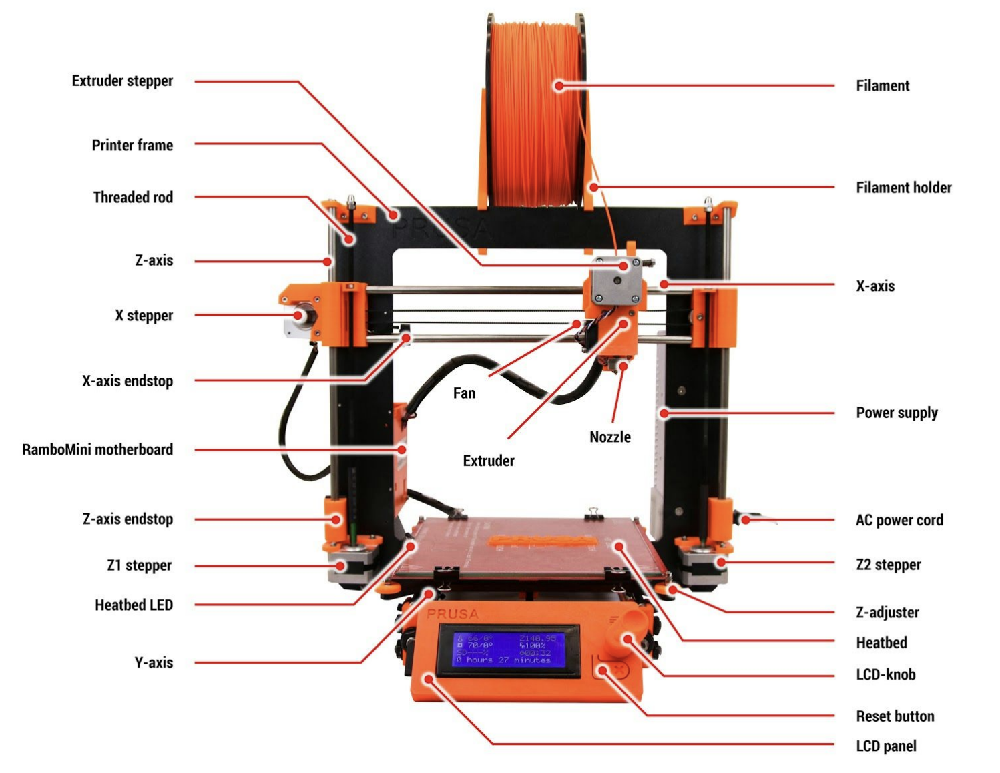

## [Main](README.md) | [Access](access.md) | [Equipment List](equipment.md) |

[Makerspace website](https://codeuniversity.github.io/makerspace/) |
[Makerspace github repo](https://github.com/codeuniversity/makerspace/) | [Makerspace Slack channel](https://codeuniversity.slack.com/archives/C011CN2SMFY)

---

# Prusa MK4S and Core One 3D printers

The MakerSpace currently has a Prusa MK4S and a Prusa CORE One Printer.

These are fast, modern high quality, reliable machinesthat deliver great performance but are also easy to use and set up for beginners with a wealth of support and advice available.

Join one of our Introduction to 3D printing workshops to get started if 3D printing is new for you. You can find these listed in the Learning Platform Events [https://app.code.berlin/events/eventSeries?](https://app.code.berlin/events/eventSeries?)

You can find material on the Prusa Website about the MK4S and the Core One [https://help.prusa3d.com/tag/mk4](https://help.prusa3d.com/tag/mk4)
[https://help.prusa3d.com/product/core-one](https://help.prusa3d.com/product/core-one)

Please download and read the Prusa introduction manual for safe and reliable printer operation
[https://help.prusa3d.com/downloads/mk3/handbook](https://help.prusa3d.com/downloads/mk4/handbook)

The MK4S and Core One printers are very similar sharing the same electronics, motors and printhead. Their speed and quality is comparable though the CORE One has a tempearature controlled printing chamber that allows heat control when printing more complex engineering filemanets such as ABS, ASA and Nylon.

_adapted from Prusa forum induction_

The PRUSA MK4S and Core one are very nice machines, and you will find that they are reliable machines with great print quality. There are thousands of users who use this machine as a workhorse, and you can too.

That said, there is a learning curve and people make mistakes. If you are expecting this to be as easy as an inkjet or laser printer, it is not, but it can become that routine once you get over the learning curve.

This is a collection things most discussed on this forum as a reference for someone having problems starting (initial section) or trouble shooting (second section). None of this is “mine” but rather a collection of the advice, solutions and problems that are frequently discussed on this forum. This should be a good place to start looking for your answers. I am in no way affiliated with PRUSA, just a user who climbed this learning curve with the help of many wonderful forum members.

These hints/step are not to be used instead of thinking. Think about the problem/steps and make sure they make sense to you. This collection is provided in good faith, but you are responsible for your machine. Electricity and heat can hurt you or the machine. Make sure you are comfortable with the steps and your knowledge before jumping in.

Please watch the introduction video here (Although this is a guide for a much older printer, the overall steps are similar and should give you a good idea of the process of 3D printing)
[https://youtu.be/JqH41K2vq0g?feature=shared](https://youtu.be/JqH41K2vq0g?feature=shared)

## Trouble Shooting

### General advice.

1. The first layer is ALL important. Get it right first. See steps listed below. This will prevent a lot of frustration.
2. Print something from the SD card that came with the printer. If it prints fine, and things you slice don’t then you have a slicer issue. If they don’t you have a hardware issue.
3. Determine if the issue is persistent or intermittent. Try to localize the conditions that cause it. This is the fastest way to get to an answer.
4. Start simple before getting advanced. This is true for material choice, model choice, adding the MMU upgrade.

Print comes loose from the bed during print, causing either spaghetti or a plastic tumor to grow on your extruder.
**Common causes:**

1. Print surface is unclean. Use provided alcohol wipes to remove any finger oil or debris.
2. Model has small footprint on the bed. Add BRIM in your slicer if the model has a flat bottom, and/or a RAFT if it has a curved bottom.
3. A part of the print has “curled” up and caught on the nozzle. Add a BRIM in your slicer if the model has sharp corners to prvent them from lifting.

Extruder stops extruding filament. (Works for a while then stops)
**Common causes:**

1. Filament spool is not free to turn creating intermittent friction or binding. (Or filament is not wound well on the roll). Fix filament holder.
2. The nozzle has been clogged with debris. Try unloading and reloading the fillament before manually purging filament.
3. Bad temperature for the filament.
4. Poor quality on the filament diameter. Measure it with a caliper over a short span. Try a different spool.

Bad surface quality on the final prints.
**Common causes:**

1. Loose belts, report to makerspace channel.
2. Linear axis (X and Y) bearings are binding or jerky (technical term). report to makerspace channel.
3. "Wet" filament creating blobs and bubbles when printing. Dry filament in filament dryer for a few hours or try different filament.
4. Slicer settings. (A topic unto itself). Try different profile, temperatures, retraction, cooling fan, etc.
5. Poor quality on the filament diameter. Measure it with a caliper over a short span. Try a different spool.

Print suddenly shifts in X or Y and keeps printing.
**Common causes:**

1. Print came loose from the print bed (see above).
2. Loose belts, report to makerspace channel.
3. Stepper motor not secured properly, report to makerspace channel.
4. Curled print hits the nozzle or PINDA sensor.
5. Binding on the axis - bearings non clean/parallel, report to makerspace.
6. Cat, kid, or ghost bumped the extruder while printing. Punish offending party.

## Software

There are 1000’s of free and pay tools out there for creating your models, slicing them, and so forth. This is really not the forum for that detailed a discussion, but here are some common ones so you can research them yourself.

### Slicers

- Convert .stl files (models) into .gcode commands for your printer. Most have 100s of settings and thus a learning curve, but the knowledge of the control is worth it, and using "Easy" or "Beginner" modes simplifies the options significantly.
- Common ones are: [Prusa Slicer (Highly Recommended)](https://www.prusa3d.com/page/prusaslicer_424/), KISS, Cura, Simplify3D (S3D) [Guide to Prusa Slicer](https://help.prusa3d.com/category/prusaslicer_204)
- There are many Prusa Slicer introduction videos - here is a reasonable one [https://www.youtube.com/watch?v=\_kIqMPNQNSw](https://www.youtube.com/watch?v=_kIqMPNQNSw)

### CAD

- [OpenSCAD](https://openscad.org/) is opensource, powerful but complex - good if you have a programming background (even just a bit). [TinkerCAD](https://www.tinkercad.com/) is a super easy introduction to making 3d Models for printing. There is also software such as [SolidWorks](https://www.solidworks.com/) and also [SketchUp](https://www.sketchup.com/en)
- Autodesk Fusion360. Industrial level 3D modelling tool with free ascess for educational use [Fusion360 download](https://www.autodesk.com/products/fusion-360/choose-usage)
  - this intro to Fusion360 from formlabs is a good quick overview [https://formlabs.com/eu/blog/fusion-360-tutorial-basics-and-tips-for-3d-printing/](https://formlabs.com/eu/blog/fusion-360-tutorial-basics-and-tips-for-3d-printing/)

### Sculpting type modeling

- [Blender](https://www.blender.org/) and similar.

### Model and mesh Manipulation:

- [Meshmixer](https://meshmixer.com/)
- [meshlab](https://www.meshlab.net)

