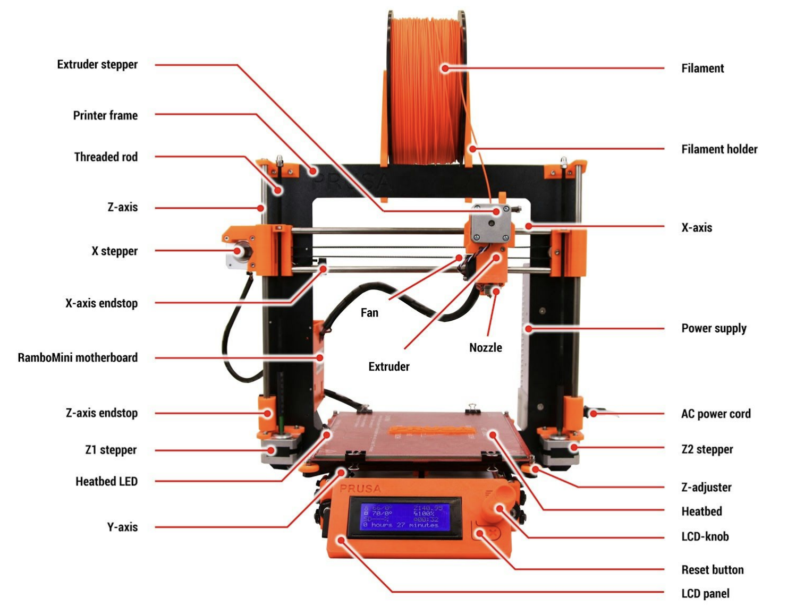

[Main](README.md) | [Access](access.md) | [Equipment List](equipment.md) | 
------------------------
[Makerspace website](https://codeuniversity.github.io/makerspace/) |
[Makerspace github repo](https://github.com/codeuniversity/makerspace/) | [Makerspace Slack channel](https://codeuniversity.slack.com/archives/C011CN2SMFY)

------------------------

# Prusa MK4s and Core One 3D printers

The MakerSpace currently has a Prusa MK4S and a Prusa CORE One + 3D Printer.

These are fast, modern high quality, reliable machinesthat deliver great performance but are also easy to use and set up for beginners with a wealth of support and advice available.

Join one of our Introduction to 3D printing workshops to get started if 3D printing is new for you. You can find these listed in the Learning Platform Events [https://app.code.berlin/events/eventSeries?](https://app.code.berlin/events/eventSeries?)

You can find material on the Prusa Website about the MK4 and the Core One [https://help.prusa3d.com/tag/mk4](https://help.prusa3d.com/tag/mk4)
[https://help.prusa3d.com/product/core-one](https://help.prusa3d.com/product/core-one)

Please download and read the Prusa introduction manual for safe and reliable printer operation 
 [https://help.prusa3d.com/downloads/mk3/handbook](https://help.prusa3d.com/downloads/mk4/handbook)

 The MK4 and Core One + printers are very similar sharing the same electronics, motors and printhead. Their speed and quality is comparable though the CORE One has a tempearature controlled printing chamber that allows heat control when printing more complex engineering filemanets such as ABS and Nylon.

*adapted from Prusa forum induction*

The PRUSA MK4S and Core one + are very nice machines, and you will find that it is a reliable machine with great print quality. There are thousands of users who use this machine as a workhorse, and you can too.

That said, there is a learning curve and people make mistakes. If you are expecting this to be as easy as an inkjet or laser printer, it is not, but it can become that routine once you get over the learning curve.

This is a collection of the advice, solutions and problems that are frequently discussed on the Prusa forum. This should be a good place to start looking for your answers.

These hints/step are not to be used instead of thinking. Think about the problem/steps and make sure they make sense to you. This collection is provided in good faith, but you are responsible for your choices. Electricity and heat can hurt you or the machine. Make sure you are comfortable with the steps and your knowledge before jumping in.

 Please watch the introduction video here to get a full understanding of 3D printing!
 [https://www.youtube.com/watch?v=2vFdwz4U1VQ](https://www.youtube.com/watch?v=2vFdwz4U1VQ)

 
## Trouble Shooting

### General advice.
1. The first layer is ALL important. Get it right first. It is easier to restart a print right at the start than dealing with spaghetti after 8 hours!
2. Most issues are caused by improper slicer settings, feel free to ask in the makerspace channel on slack if you need advice!
3. Determine if the issue is persistent or intermittent. Try to localize the conditions that cause it. This is the fastest way to get to an answer.
4. Start simple before getting advanced. Low-Poly and lower detail models are much easier to print and will be easier to slice too.

Print comes loose from the bed during print, causing either spaghetti or a plastic tumor to grow on your extruder.
**Common causes:**
1. Print bed is not clean - use an alcohol wipe to clean it and retry. Even oil from peoples hands can make adhesion less reliable.
2. Model has small footprint on the bed - Add BRIM in your slicer if the model has a flat bottom, and/or a RAFT if it has a curved bottom.
3. A part of the print has “curled” up and caught on the nozzle - Look at supports or a BRIM in the slicer, and consider increasing bed temperature.

Extruder stops extruding filament. (Works for a while then stops)
**Common causes:**
1. Filament spool is not free to turn creating intermittent friction or binding. (Or filament is not wound well on the roll - some cheeper brands or re-fillable filament spools are prone to tangling).
2. The filament being used is not the same as set in the slicer or selected when loading.
3. The printer has clogged with debris - unload, cut, and reload the filament. If it is still having issues then report in makerspace channel on slack.
4. Poor quality on the filament diameter. Measure it with a caliper over a short span. Try a different spool.

Bad surface quality on the final prints.
**Common causes:**
1. Slicer settings. (A topic unto itself). Try different temperatures, retraction, cooling fan, etc.
2. Poor quality on the filament diameter. Measure it with a caliper over a short span. Try a different spool.
3. Issues with the machine - ask in makerspace channel if you need assistance.

Print suddenly shifts in X or Y and keeps printing.
**Common causes:**
1. A part of the print has “curled” up and caught on the nozzle - Look at supports or a BRIM in the slicer, and consider increasing bed temperature.
2. The print has come loose from the bed (See Above).
3. Cat, kid, or ghost bumped the extruder while printing. Punish offending party.

## Software

There are 1000’s of free and pay tools out there for creating your models, slicing them, and so forth. This is really not the forum for that detailed a discussion, but here are some common ones so you can research them yourself.

### Slicers 
Convert .stl files (models) into .gcode commands for your printer. These can make a HUGE difference in your print quality. Most built-in presets are more than good enough for reliable prints, but for advanced control, most slicers have 100s of extra settings and thus a learning curve, but the knowledge is worth it.

Common ones are:
1. [Prusa Slicer](https://www.prusa3d.com/p/prusaslicer/) - The most suitable for the prusa machines with great presets.
2. Bambu Studio
3. Orca Slicer
4. Cura

### CAD
 * [OpenSCAD](https://openscad.org/) is opensource, powerful but complex - good if you have a programming background (even just a bit). [TinkerCAD](https://www.tinkercad.com/) is a super easy introduction to making 3d Models for printing. There is also software such as [SolidWorks](https://www.solidworks.com/) and also [SketchUp](https://www.sketchup.com/en)
* Autodesk Fusion360. Industrial level 3D modelling tool with free ascess for educational use [Fusion360 download](https://www.autodesk.com/products/fusion-360/choose-usage)
  * this intro to Fusion360 from formlabs is a good quick overview [https://formlabs.com/eu/blog/fusion-360-tutorial-basics-and-tips-for-3d-printing/](https://formlabs.com/eu/blog/fusion-360-tutorial-basics-and-tips-for-3d-printing/)
   
### Sculpting type modeling
* [Blender](https://www.blender.org/) and similar.

### Model and mesh Manipulation: 
* [Meshmixer](https://meshmixer.com/)
* [meshlab](https://www.meshlab.net)

 
